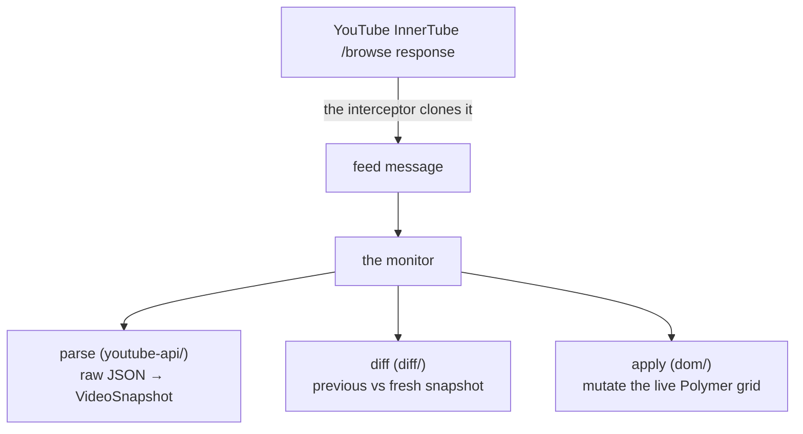

# Architecture

How YouTube Auto Feed keeps the subscriptions feed (`/feed/subscriptions`) live - new
uploads, status changes (upcoming -> live -> ended), removals, and metadata edits appear
without a page reload.

This document traces the path a feed change takes, from YouTube's network response to the
animated DOM update, and points to where each concern lives. It is a map, not an API
reference - read it first, then open the folder for the stage you care about.

## The three pieces

The extension runs as three independent contexts on `youtube.com`:

1. **The interceptor** - a `MAIN`-world content script injected at `document_start`. It
   wraps `fetch` so it can see YouTube's own data without making extra requests.
2. **The monitor** - the other `MAIN`-world content script. It owns the polling loop and
   every DOM mutation. This is the bulk of the code (`src/subscription-feed/`).
3. **The popup** - a small Svelte settings UI. Its two toggles (extension on/off,
   animations on/off) reach the monitor through a settings bridge.

`MAIN` world matters: the feed is rendered by YouTube's Polymer/Lit components, and the
extension drives those components directly (their data and methods only exist in the
page's own JavaScript world, not an isolated content-script world).

## The journey of a feed update



1. **Capture.** The interceptor watches every `fetch`. When YouTube itself loads the
   subscriptions feed (an InnerTube `/browse` call for `FEsubscriptions`), the interceptor
   lets the real request through, then clones the JSON response and forwards it to the
   monitor over a typed custom-event channel. It also notices subscribe/unsubscribe calls
   and tells the monitor the feed changed. The monitor's own polling requests are tagged
   with a marker header so the interceptor ignores them (no infinite loop).

2. **Poll on a cadence.** Once on the subscriptions page, the monitor (`polling/`) refetches
   the feed on a timer - the full feed every 5 seconds and a lighter metadata-only pass every
   10 seconds, after an initial ~10s settle - and pauses entirely while the tab is hidden. The
   interceptor's captured `/browse` response seeds the first baseline; each subsequent poll
   re-fetches the `/feed/subscriptions` page HTML and reads `ytInitialData` out of it (the
   global `ytInitialData` goes stale across YouTube's SPA navigation, so re-fetching is the
   only way to get fresh data), parses it, and hands it to the diff. Subscribe/unsubscribe
   events trigger an immediate refetch.

3. **Parse.** The raw InnerTube payload is messy and its shapes vary (videos, lockups,
   shorts, legacy shelves). `youtube-api/` validates it through Zod schemas and flattens it
   into a clean `VideoSnapshot[]` plus the raw grid contents. Nothing downstream touches raw
   InnerTube shapes directly.

4. **Diff.** `diff/` compares the previous snapshot with the fresh one and sorts the
   differences into buckets: added, removed, repositioned, moved-to-front (live leads),
   moved between sections, and metadata-only edits (title, view count, thumbnail, status).

5. **Apply.** This is where the feed actually changes, all inside `dom/`:
   - **Metadata-only** edits patch the existing tile in place (`dom/update/`) - no reflow.
     A/B-tested thumbnails are a special case: YouTube swaps the served picture under a stable
     URL, so the URL-keyed diff never sees it. A periodic content check re-fetches the visible
     thumbnails and dissolves to the new picture only when the image bytes actually change.
   - **Structural** changes (add / remove / reorder) go through the **mirror**
     (`dom/mirror/`). The mirror merges the fresh API ordering into the grid's current
     contents and writes the result back through Polymer, then animates the change with a
     Google-Meet-style slide: surviving tiles glide to their new slots, a new tile scales and
     fades in, a removed tile dissolves in place while its neighbours close the gap.
   - **Shelf pruning.** Rich shelves (`Most relevant`, `Shorts`) keep their own copies of
     videos, and YouTube inconsistently omits still-valid ones from a poll, so absence alone
     is not trusted there. A shelf video is removed only when it is genuinely gone or no longer
     wanted: subscription is read from the video's own watch-page HTML (the only context that
     reports the viewer's real subscribed state - the JSON endpoints under-report it), and
     deletion is confirmed by a 404 from a lightweight oEmbed call. Both verdicts are cached
     and capped per poll. Insertion stays Latest-band only; this step never adds to a shelf.

## Where things live

```
src/
  entrypoints/
    fetch-interceptor.content.ts   the interceptor (wraps fetch)
    main.content.ts                starts the monitor
    popup/                         settings UI (Svelte)
    styles.content/                injected CSS (the animations)
  shared/                          cross-context messaging + settings storage
  subscription-feed/               the monitor
    polling/                       the timer loop: fetch, schedule, apply, lifecycle, state
    youtube-api/                   parse raw InnerTube -> VideoSnapshot (Zod-validated);
                                   watch-page + oEmbed probes for shelf-prune subscription/availability
    diff/                          previous vs fresh -> change buckets
    dom/                           everything that touches the page
      query/                       read the current grid into a snapshot
      mirror/                      live-mirror the API into the grid + FLIP/ghost animations;
                                   prune unsubscribed/deleted shelf videos
      band/                        section + row ("band") layout maths
      update/                      patch a single tile's metadata in place; watch A/B thumbnail swaps
      cleanup/                     remove orphaned / stale grid items
      lazy/                        defer off-viewport changes (animate only what's visible)
      animations.ts, rich-item.ts shared DOM helpers
    types/                         InnerTube + Polymer type models
    utils/                         small shared helpers
```

A useful way in: pick a stage from "the journey" above, open the matching folder, and the
file names describe themselves (e.g. `mirror/mirror-survivors`, `mirror/mirror-ghosts`).

## Rules the code must respect

These are hard constraints - breaking them corrupts the live feed:

- **Section structure is read-only.** The extension may only add or remove videos within a
  section. It must never reorder, merge, or move the section markers YouTube emits - whatever
  order (including repeats) YouTube sends is what gets rendered.
- **Mutate through Polymer, never `innerHTML`.** The grid's contents are changed by calling
  the grid component's own `set(path, value)`; it exposes no splice/push, and raw HTML edits
  break it.
- **Go through the schemas.** InnerTube shapes vary and are modelled as Zod schemas; read
  them through those guards, never by indexing into raw shapes.
- **Animate only what the viewer can see.** Off-viewport changes apply instantly; the FLIP /
  ghost animations are reserved for tiles in (or near) the viewport.

## Dev + verification

`pnpm dev` launches the supported dev loop (Edge via web-ext, auto-reload on save). The
extension targets Chromium (Chrome / Edge / Opera) and Firefox MV3; per-target minimum
browser versions are declared in `wxt.config.ts`. Because the page is live YouTube, changes
are verified by comparing the extension's grid against a no-extension browser as ground
truth (see `CLAUDE.md`).
